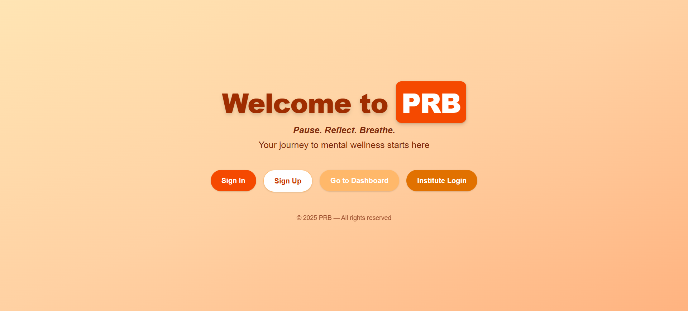
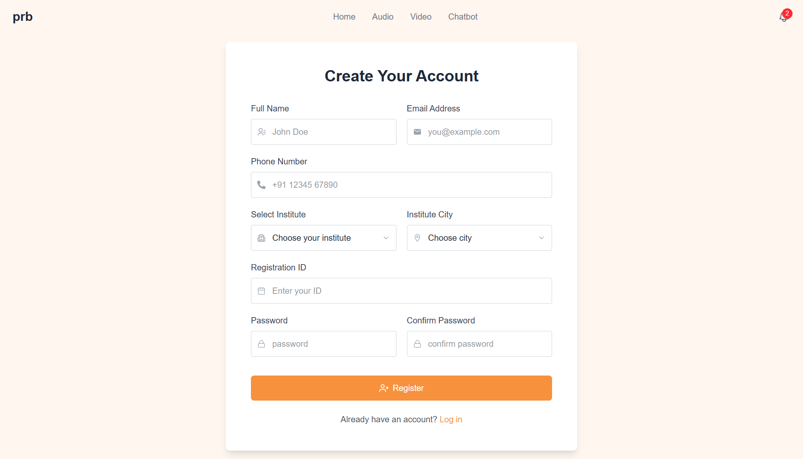
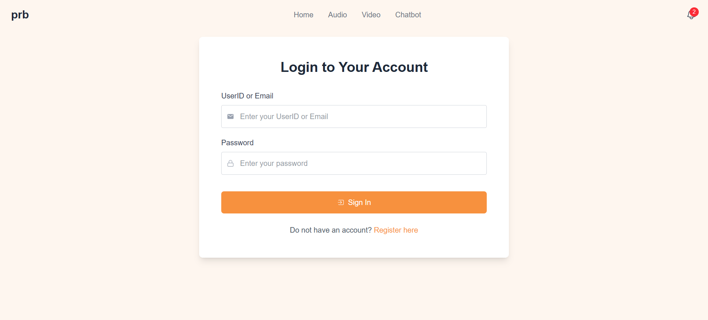
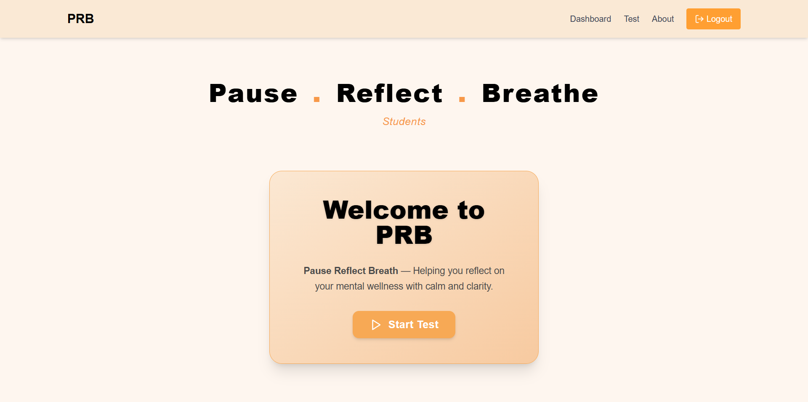
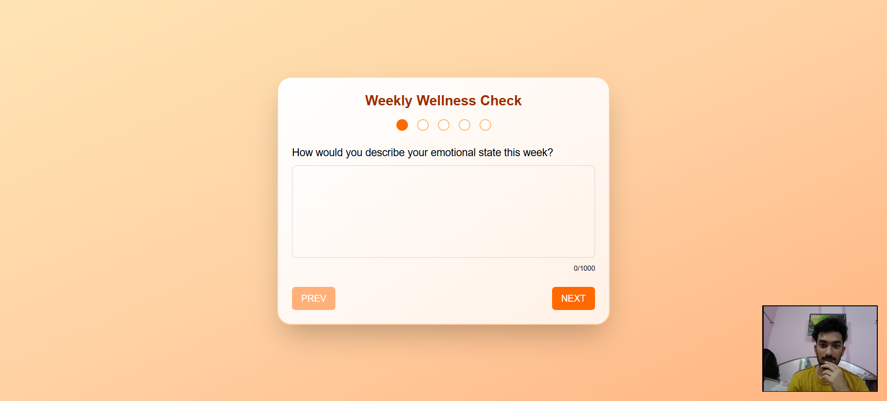
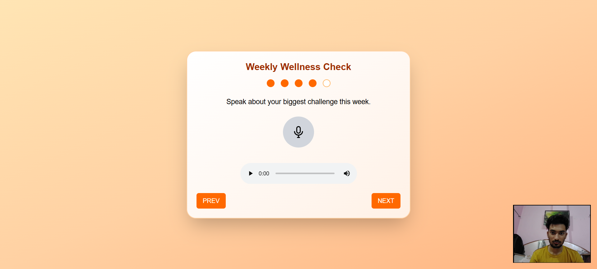
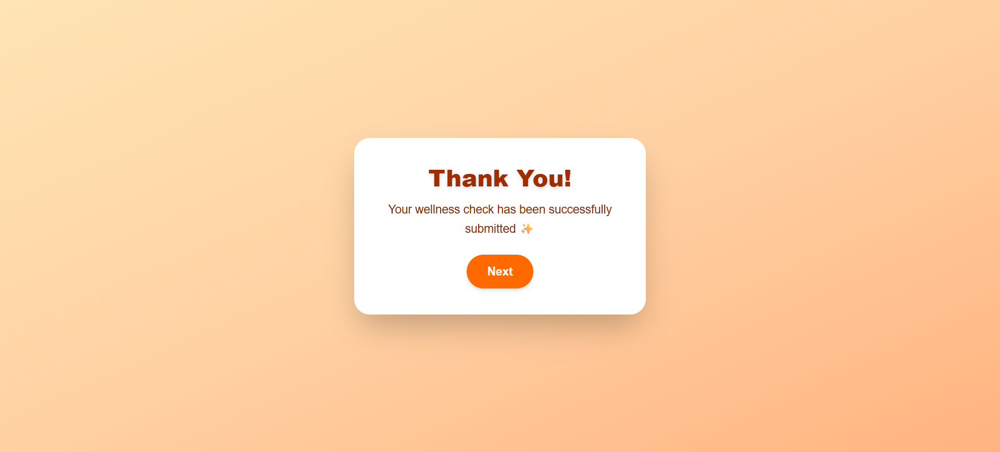
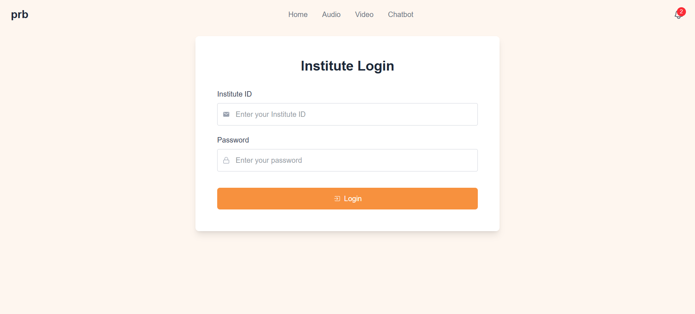
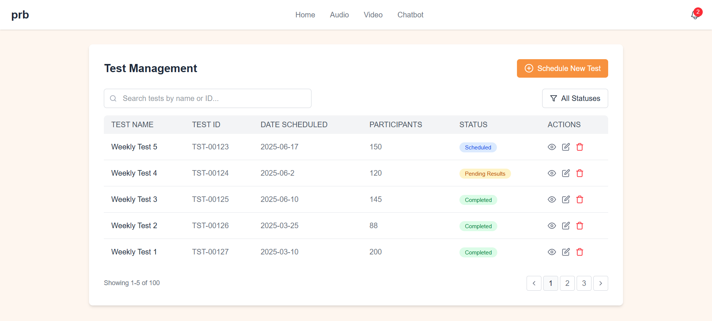
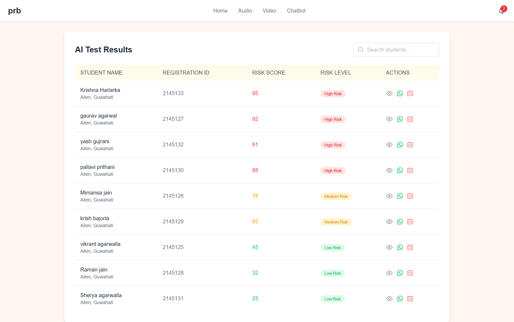

# 🧠 AI-Powered Suicide Prevention System

Student mental health in India is in crisis. In places like Kota, the academic pressure has led to tragic outcomes — with dozens of student suicides every year. Pause Reflect Breathe is our response. We’ve built an AI-powered suicide prevention platform that conducts weekly emotional check-ins through text, voice, and video — identifying early signs of mental distress and enabling timely intervention. This is not just a tool. It’s a system designed to uncover hidden pain, offer support, and protect young lives — before it's too late.

---

## 🚀 Features

- 🔐 Secure User Authentication
- 📝 Weekly Cognitive & Emotional Test
  - 📸 Image Capture (Facial Emotion Detection)
  - ⌨️ Typed Questions (Sentiment Analysis)
  - 🎤 Voice-Recorded Questions (Tone Analysis)
- 🧠 AI-Powered Risk Assessment
- 🧑‍⚕️ Admin Dashboard for Monitoring & Alerts
- 🔔 Emergency Notification System

---

## ⚙️ Tech Stack

| Layer     | Technology Used                        |
| --------- | -------------------------------------- |
| Frontend  | Next.js, Tailwind CSS                  |
| Backend   | Next.js Integrated Backend, TypeScript |
| Database  | MongoDB                                |
| AI Models | SDCNN, NLTK, Pytorch, LSTM, XGBoost    |
| DevOps    | Render, Vercel , GitHub, Postman       |

---

### 🔗 AI Model Repository

You can find the AI model implementation [here](https://github.com/Tahmid019/SDCNL-Implementation).

---

<details>
  <summary><strong>Click to view screenshots</strong></summary>

### 🖼️ Application Screenshots

| Screenshot 1                      | Screenshot 2                      |
| --------------------------------- | --------------------------------- |
|  |  |

| Screenshot 3                      | Screenshot 4                      |
| --------------------------------- | --------------------------------- |
|  |  |

| Screenshot 5                      | Screenshot 6                      |
| --------------------------------- | --------------------------------- |
|  |  |

| Screenshot 7                      | Screenshot 8                      |
| --------------------------------- | --------------------------------- |
|  |  |

| Screenshot 9                      | Screenshot 10                      |
| --------------------------------- | ---------------------------------- |
|  |  |

</details>

---

## 🌟 Unique Selling Points (USP)

- 🧠 Multi-Modal AI Detection (Image + Text + Voice)
- ⏱️ Continuous & Non-Intrusive Weekly Assessment
- 📊 Real-Time AI Risk Scoring
- 🔐 Privacy-Centric with Emergency Alert Protocol
- 🏫 Scalable for Schools, Colleges, and Workplaces

---

## 🛡️ Ethics & Privacy

- End-to-end encrypted data
- Full user consent required
- AI transparency with human oversight

---

## 📈 Future Scope

- Mobile App Integration
- Real-time Chatbot for First Aid Mental Support
- Wearable Data Integration (e.g., Sleep, HR)
- Feedback Loop for Model Improvement

---

## 👥 Group Members

- Mayukh – Team Lead
- Tahmid Choudhury
- Pallavi Prithani
- Binit Agarwalla
- Bishal Das

---

## 🤝 Contributing

```bash
# Clone the repo
git clone https://github.com/your-username/ai-suicide-prevention.git

# Install dependencies
cd ai-suicide-prevention
pnpm install

# Start the server
pnpm run dev
```
